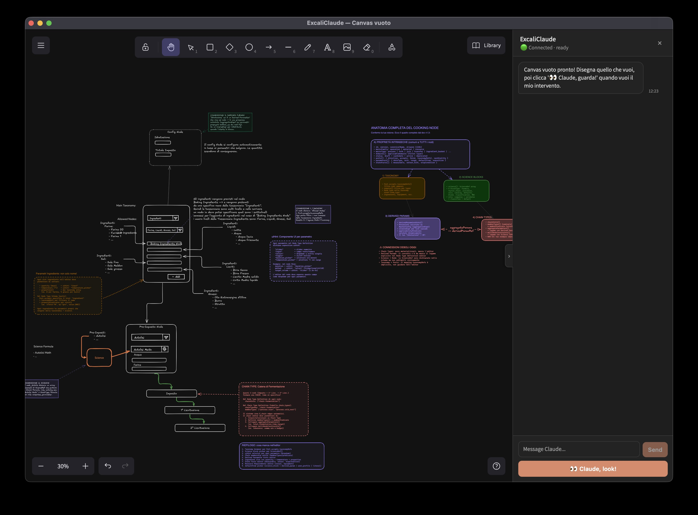

# ExcaliClaude

A [Claude Code](https://docs.claude.com/claude-code) plugin that enables **bidirectional visual collaboration** between humans and Claude on a live [Excalidraw](https://excalidraw.com) canvas.



Claude opens a native window with Excalidraw and an integrated Claude sidebar. The human draws, Claude responds both textually (in the sidebar) and visually (by adding, modifying, and annotating elements on the canvas).

## Architecture

```
Claude Code CLI
     │ (MCP stdio)
     ▼
ExcaliClaude MCP Server  ──spawn──►  Canvas App (Bun/Node)
 (26 legacy tools +                  ├─ Express + WebSocket
  8 session tools)                   └─ Native webview-bun window
                                        (fallback: Chrome app-mode)
```

Each session is an **independent process** with its own port and dedicated window, managed by the central `SessionManager`.

## MCP Tools

**26 legacy tools** inherited from the [yctimlin/mcp_excalidraw](https://github.com/yctimlin/mcp_excalidraw) fork:

- **Elements** — `create_element`, `update_element`, `delete_element`,
  `get_element`, `batch_create_elements`, `duplicate_elements`, `query_elements`
- **Layout** — `align_elements`, `distribute_elements`, `group_elements`,
  `ungroup_elements`, `lock_elements`, `unlock_elements`
- **Export/Import** — `export_scene`, `import_scene`, `export_to_image`,
  `export_to_excalidraw_url`, `create_from_mermaid`
- **Inspect** — `describe_scene`, `get_canvas_screenshot`, `snapshot_scene`,
  `restore_snapshot`, `clear_canvas`, `set_viewport`, `read_diagram_guide`

**8 new session tools** introduced by ExcaliClaude:

| Tool | Description |
|---|---|
| `open_canvas` | Opens a new canvas in a dedicated window |
| `close_canvas` | Closes a session, optionally saving it |
| `list_sessions` | Lists active sessions |
| `wait_for_human` | Blocks until the human clicks "Claude, look!" |
| `save_session` | Saves the current state as an `.excalidraw` file |
| `send_message_to_canvas` | Sends a Claude message to the sidebar |
| `annotate` | Annotates an element with a note and arrow |
| `get_human_changes` | Retrieves recent human-made changes |

## Installation (development)

```bash
git clone https://github.com/ttessarolo/excaliclaude.git
cd excaliclaude
npm install
npm run build
```

## Build

### Dev mode

```bash
npm install
npm run build          # server + frontend (tsc + vite)
npm run dev:canvas     # tsx watch canvas server (port 3000)
npm run dev            # vite frontend + tsc watch
```

### Standalone binary

The canvas runtime is distributed as a **single Bun executable** that bundles the runtime, Express server, Excalidraw frontend, and native window into one file — no dependency on Bun or Chrome installed on the user's machine.

```bash
# One-time: install Bun
curl -fsSL https://bun.sh/install | bash

# Build binary for the current platform
npm run build:bin
# → dist/bin/canvas-<platform>-<arch>  (~82 MB)
```

The `SessionManager` automatically detects the binary in `dist/bin/` and prefers it over the legacy 2-process spawn. If the binary is missing, it falls back to dev mode (`node dist/canvas-app/start-server.js` + webview-bun/Chrome).

> **macOS:** unsigned `bun build --compile` binaries are blocked by Gatekeeper.
> `build-bin.ts` applies an ad-hoc codesign after compilation, so the local
> binary works without any extra configuration.

Then register the plugin in Claude Code:

```bash
/plugin marketplace add ttessarolo/excaliclaude
/plugin install excaliclaude@excaliclaude-marketplace
```

## Usage

In a conversation with Claude Code:

> Open a canvas, I want to discuss my project's architecture

Claude will automatically activate the `excaliclaude` skill, open a canvas window, draw an initial proposal, and wait for your feedback. Click **"👀 Claude, look!"** in the sidebar whenever you want Claude to review the canvas.

## License

MIT — derived from [yctimlin/mcp_excalidraw](https://github.com/yctimlin/mcp_excalidraw).
